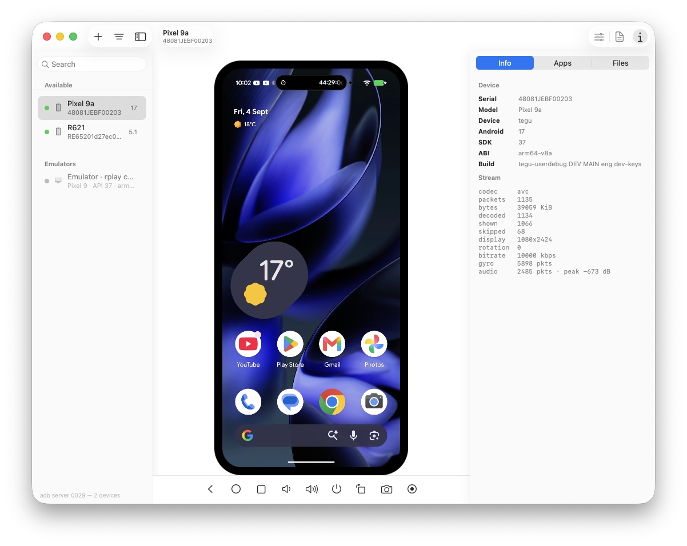
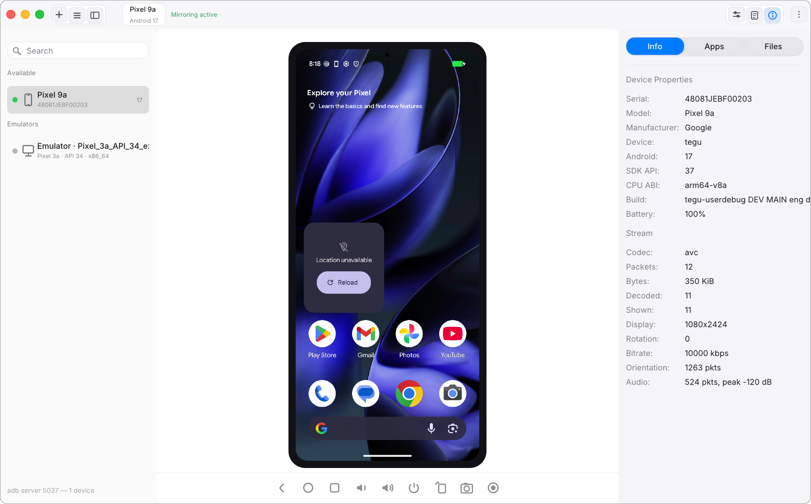
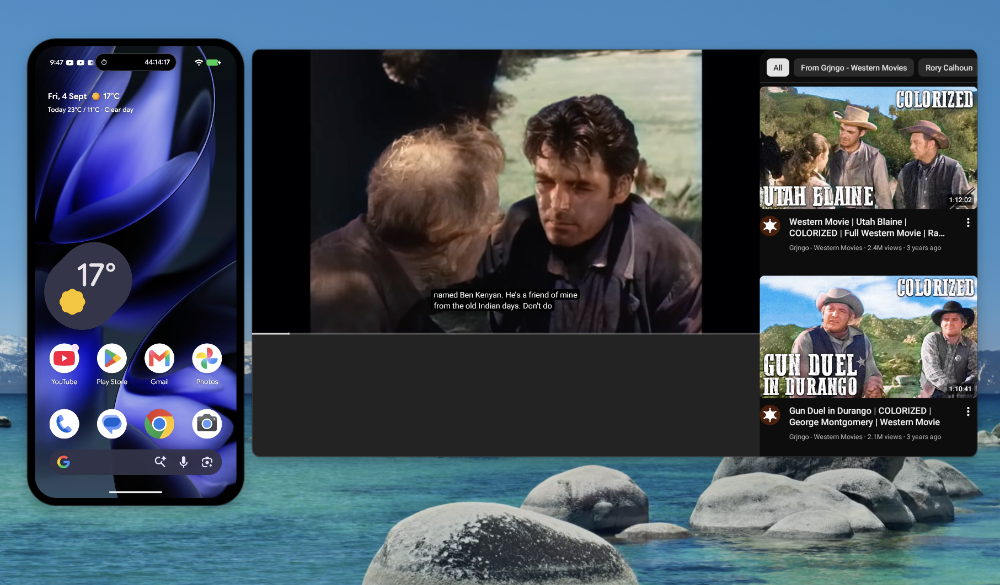
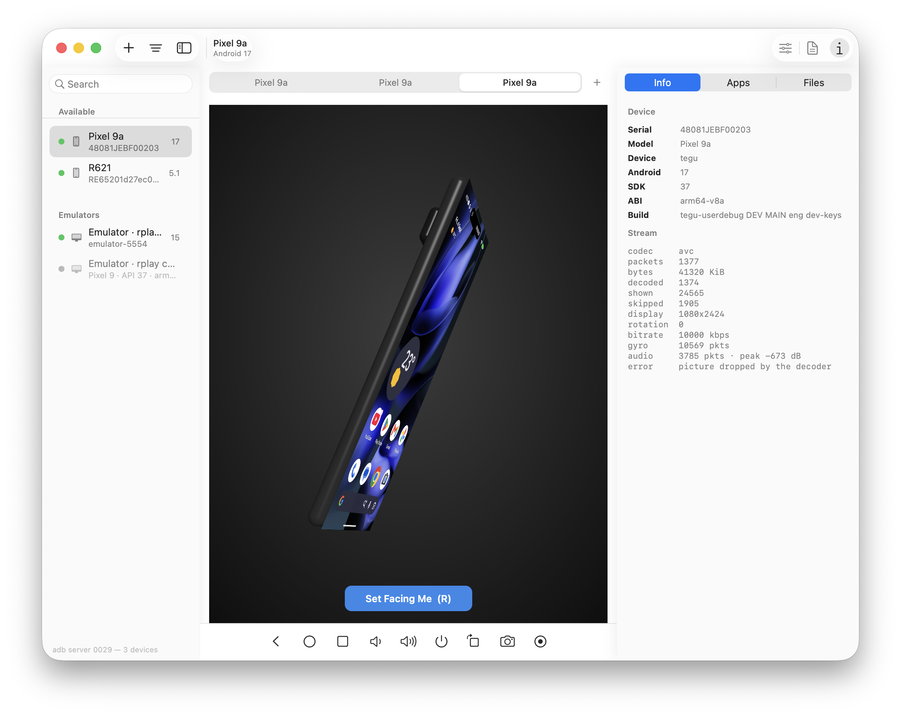
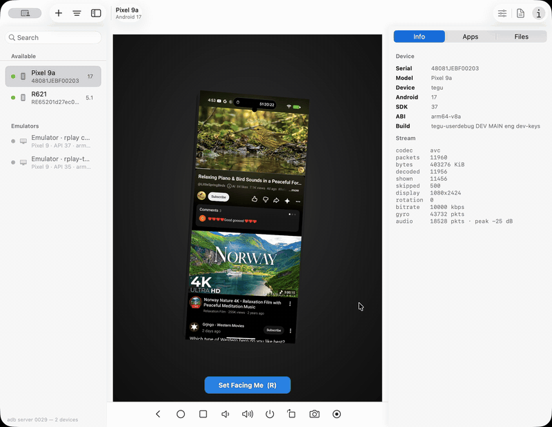

# rplay-hub-android

[](https://github.com/rPlayAI/rplayhub-android/releases/latest)
[](https://github.com/rPlayAI/rplayhub-android/releases)
[](https://github.com/rPlayAI/rplayhub-android/releases)
[](LICENSE)
[](https://github.com/rPlayAI/rplayhub-android/stargazers)

**Your Android phone on your desktop computer** (macOS and Linux; Raspberry Pi next, Windows upcoming) —
mirror it, control it, run its apps in windows of their own, open its files in Finder, and run
Android VMs without installing Android Studio. Built on Google's own on-device agent (the one behind Android
Studio's *Running Devices*), driven over `adb`, with a native app in front of it.

It is for developers — every device, every emulator, every API level from Android 5.0 up — and
just as much for anyone who wants their phone on a bigger screen.

**macOS**



*macOS — a Pixel 9a and an Android 5.1 car unit over USB, a VM in the list, the phone live in
the middle, its info, apps and files on the right.*

**Linux**



*Linux (Ubuntu 22.04) — the same Pixel 9a over USB, an emulator in the sidebar, the Info tab
with the device and stream details.*

Sibling project: `~/rplay-hub`, the same thing for iPhone. This one is the easier half, and the
reason is worth stating plainly: on iOS we had to reverse-engineer CoreDevice and write both
ends. Here Google's device agent is **Apache 2.0 and published**, so only the host is ours.

## Download

| | |
|---|---|
| **macOS 13+** | [rPlayHub Android 1.0](https://github.com/rPlayAI/rplayhub-android/releases/tag/v1.0) — notarized DMG, adb and the agents bundled |
| **Linux x86_64** (Ubuntu 22.04+, Debian 12+) | [rPlayHub Android for Linux 1.0.1](https://github.com/rPlayAI/rplayhub-android/releases/tag/linux-v1.0.1) — `.deb`; `sudo apt install ./rplayhub-android_1.0.1-1_amd64.deb` |
| **Raspberry Pi** (arm64) | next — the Linux client builds on the Pi today, see [`doc/LINUX-AND-RPI.md`](doc/LINUX-AND-RPI.md); a package follows |

## For regular users

You do not need to be a developer, and nothing is installed on the phone beyond what `adb`
puts there for the session. Plug the phone in (or connect over Wi‑Fi), turn on USB debugging
once, and:

- **Use Android apps on the Mac, seamlessly.** Any app on the phone opens in a window of its
  own on the Mac — WhatsApp, YouTube, a bank's app, a game — with its own keyboard focus, at
  desktop size, several at once. Click, type, scroll; it is the real app, running on the phone,
  with the phone's own account, data and notifications. The phone's screen stays yours to use.
- **Put an app on the Desktop.** *Add Front App to Desktop* makes a double-clickable icon with
  the app's own icon; double-click it and the app opens in its window, launching everything
  needed on the way.
- **The whole phone as a window,** if that is what you want: the bare phone, rounded corners
  and all, floating on the desktop, or Android's own Desktop Mode — taskbar, launcher and
  windowed apps — as a second desktop.
- **Sound, clipboard, files, photos.** The phone's audio plays through the Mac. Copy on one,
  paste on the other. The phone's storage is a folder in Finder; drag files either way. Share
  a photo from any Android app to "Send to Mac" and it lands on the Mac as a draggable thumbnail.
- **Old devices too.** An Android 5–7 box, a car head unit, a set-top box — they mirror as well.
- **Try Android without a phone.** *Create Android VM…* downloads and boots a virtual Pixel in
  about a minute, no Android Studio, no JDK.

## What this is, and is not

It is a from-scratch reimplementation of Android Studio's **Running Devices** window — the
mirroring and control half of it, nothing else — grown well past it. Same on-device agent, same
wire protocol, none of the IDE.

It is **not** a reimplementation of adb. adb is the documented interface, Studio itself goes
through it, and the interesting part of the link is the device end. That is the one place this
project's instincts differ from `~/rplay-hub`, where replacing usbmuxd was the whole point.

## What it does

**Mirror and control.** The phone's screen live on the Mac, hardware-decoded; clicks are
touches, drags are drags, the keyboard types. Rotation follows the device. A pop-out window
shows just the phone — rounded corners, transparent surround, no chrome until the pointer nears
its edge — or a tab in the center panel, or the 3D twin below. Screenshots and screen recording
from the Mac side (recording is host-side, so it works for virtual displays too and has no
three-minute cap). Everything a device can do is one right-click away, on its sidebar row or on
the picture itself.


*One right-click on a device: Desktop Mode, Finder, screenshot and recording, the Android keys,
wake and power, the 3D twin, an app onto a virtual display, windows and tabs.*

**Desktop Mode and app windows.** One click puts Android's desktop — taskbar, launcher and all —
in a window of its own on a virtual display, while the phone's own screen keeps mirroring. Any
installed app can be opened the same way, in a bare window with no taskbar, several at once.
Closing the window closes the display. An app can also live as an icon on the Mac's Desktop:
double-click it and it opens in its window on the phone.



*The Pixel's own screen as a bare window, and YouTube — running on the phone, on a virtual
display the phone does not have — in a window of its own next to it. Both live at once.*

**Audio, clipboard, files.** The phone's audio plays through the Mac (Opus, 48 kHz). The
clipboard syncs both ways. `/sdcard` mounts in Finder, read/write, through a File Provider
extension. Drop an APK on the mirror to install it, drop a file to send it. Drag an app out of
the Apps tab to get its APK, a file out of the Files tab to get the file. A small companion app
on the phone adds "Send to Mac" to Android's share sheet; what you share lands on the Mac as a
draggable thumbnail.

**Emulators and Android VMs.** See below.

**Older devices.** Android 5.0–7.1 boards — car head units, set-top boxes, the things Studio's
agent cannot reach because it needs API 26 — mirror through a small agent of our own (one Java
file, `legacy-agent/`), verified on an API 22 car unit.

**The 3D device twin** (experimental, gated). A 3D phone that turns as the real one turns,
driven by the device's rotation sensor, with the mirror texture-mapped onto its glass. See
below.

## Emulators and Android VMs

An emulator is a first-class device: a running AVD appears in the sidebar under **Emulators**,
named after its AVD, and mirrors and controls like a phone. Two things go further than that:

- **Hosting.** With the gate on (`RPLAYHUB_EMU=1`, or the setting), a selected emulator is
  *hosted* the way Android Studio's embedded emulator is: the engine runs headless and its
  display and input go over the emulator's own gRPC (`EmulatorController`) — no Qt window, no
  virtual display, no on-device agent. The same instance stays on adb, so every tool keeps
  working against it. `doc/EMULATOR-HOST.md` has the design.
- **Creating VMs with no Android Studio, no JDK, no sdkmanager.** *Create Android VM…* reads
  Google's SDK repository index, downloads the emulator and a system image (with the SDK license
  shown and accepted in-app), verifies and unpacks them, writes the AVD, and boots it — about a
  minute from nothing to a running Pixel-profile VM. Every AVD on the Mac is a sidebar row,
  running or not, with Start and Remove on the row; a VM that isn't running shows its profile
  ("Pixel 9 · API 37 · arm64-v8a"). Remove deletes the VM's own disks and keeps the system
  image, which other VMs share.

Nothing of Google's emulator or system images is bundled — the SDK license forbids
redistributing them — they are downloaded on demand into your SDK, or into an app-owned folder
if you have none.

## Layout

Folder conventions follow `~/rplay-hub`: adopted sources recorded in `refs/`, tooling in
`tools/`, protocol notes in `doc/`.

- **`app/`** — **rPlayHubAndroid**, the macOS app. Swift + AppKit, an Xcode project. See
  `app/README.md`.
- **`legacy-agent/`** — the Android 5.0–7.1 agent, one Java file, built with `javac` + `d8`.
- **`helper/`** — the companion "rPlayHub Share" APK.
- **`emulator-transport/`** — the gRPC bridge the hosted emulator talks through (SwiftPM; the
  app spawns it, so grpc-swift never links into the app).
- **`linux/`** — the Linux client. C++17, SDL2, FFmpeg, Dear ImGui; the same window, menus,
  inspector, pop-out, 3D twin and foldable support as the Mac. See `linux/README.md`.
- **`refs/studio/`** — the adopted Apache-2.0 source: the device agent complete, and Studio's
  Kotlin host for reference. See `refs/studio/PROVENANCE.md` for commit, refetch and our local
  modifications.
- **`doc/STUDIO-MIRRORING-PROTOCOL.md`** — the wire protocol, read out of that source.
- **`doc/EMULATOR-HOST.md`** — the emulator track.
- **`doc/PORTING.md`** — the OS seams, and why the web port is a different shape.
- **`tools/build-agent.sh`** — builds the agent and lays it out where the app looks for it.
- **`tools/build-legacy-agent.sh`**, **`tools/build-helper.sh`** — the legacy agent and the
  companion APK.
- **`tools/gen-xcodeproj.py`** — regenerates the Xcode project from the source files present.
- **`tools/package-dmg.sh`** — a self-contained, notarized DMG (bundles adb, the agents and
  the companion APK).
- **`tools/package-deb.sh`** — the Linux `.deb`, built against the distribution's SDL2 and
  FFmpeg (bundles the agent; adb comes from the distribution).

## Quick start

macOS, from source (Linux: `linux/README.md`, or install the `.deb` above):

```
tools/build-agent.sh          # needs a JDK 17+, the Android SDK and an NDK (see below)
python3 tools/gen-xcodeproj.py
xcodebuild -project app/rPlayHubAndroid.xcodeproj -scheme rPlayHubAndroid -configuration Debug -derivedDataPath build/dd build
open build/dd/Build/Products/Debug/rPlayHubAndroid.app --env RPLAYHUB_AGENT_DIR=$PWD/build/agent
```

Then plug in a device with USB debugging on, accept the prompt, and click its row. Or use
**+ ▸ Create Android VM…** and have one built for you.

## Status

| | |
|---|---|
| Mirror, touch, keyboard, rotation — H.264, hardware decode | **shipping** — verified against Pixel phones over USB and network adb |
| Desktop Mode, apps in windows of their own (virtual displays), many at once | **shipping** |
| Audio forwarding, clipboard sync, turn screen off while mirroring | **shipping** |
| Files in Finder (File Provider), drag-and-drop both ways, companion share app | **shipping** |
| Screenshots, host-side screen recording | **shipping** |
| Pop-out phone window, center-panel tabs, 3D twin | **shipping** (twin gated) |
| Emulators in the sidebar; hosting over gRPC | **shipping**, hosting gated |
| Create Android VM with no Studio/JDK; VM list with Start/Remove | **shipping** |
| Android 5.0–7.1 through our own agent | **shipping** — verified on an API 22 car unit |
| Auto-reconnect, packet validation, the -12909 decoder fix | **shipping** |
| Mac App Store build (sandboxed, standard entitlements only) | builds and uploads |

**On the decoder fix (2026-08-30):** long sessions used to die with
`kVTVideoDecoderBadDataErr (-12909)`. The agent's `SocketWriter::Write()` can time out with a
video packet *half-written*, and upstream's `display_streamer.cc` writes the next packet right
after the truncation — desynchronising the byte stream until VideoToolbox is handed garbage.
Fixed in two layers: our agent build ends the stream on a video write timeout (see
`refs/studio/PROVENANCE.md`), and the host validates every packet header and auto-reconnects on
desync or mid-stream agent exit.

## The 3D device twin (experimental)



*The 3D twin — a 3D phone whose orientation tracks the real device, gyro-tracked, with the mirror live on its glass.*



*The model turns as the phone turns; here it swings round to the phone's 3D back. (Full-quality clip: [download the mp4](doc/rPlayHub-android-3d.mp4).)*

A display mode, not a second viewer: "View in 3D" swaps the flat mirror for a 3D phone whose
orientation tracks the real device's rotation vector sensor live — turn the phone in your hand
and the model turns on screen, with the mirrored display texture-mapped onto its glass. Drag to
orbit the camera. Re-centre (R, or the button) is a calibration: hold the phone parallel to your
Mac's screen and press it — that pose becomes face-on, and every motion after is shown as the
delta from it, heading-corrected so directions stay true. `RPLAYHUB_FAKE_GYRO=1` replaces the
sensor with scripted poses for verifying exactly that without a hand on the phone.

Gated off by default: enable with **View ▸ 3D Device Twin (Experimental)** (persisted), or
`RPLAYHUB_TWIN=1` for one launch. The gate also controls the extra agent channel — our agent
build streams 50 Hz quaternions on a fourth socket only when asked (flag `0x100`; see
`refs/studio/PROVENANCE.md`).

## Platforms

**macOS and Linux ship.** A Raspberry Pi package is next, a Windows port is **in progress**,
and a browser client is planned.

| | |
|---|---|
| **macOS** | Swift + AppKit, VideoToolbox — **shipping** (DMG and Mac App Store builds) |
| **Linux** | C++17, POSIX sockets, FFmpeg decode, SDL2 + Dear ImGui — **shipping** (`.deb` for Ubuntu 22.04+ / Debian 12+, x86_64): mirroring, touch, keyboard, audio, clipboard, Desktop Mode and app windows, pop-out window, screenshots and recording, the 3D twin, foldables (Pixel Fold: posture, hinge angle, the fold drawn live, the duo twin); verified on Pixel phones and the Android emulator. Existing AVDs start and mirror from the sidebar; not yet there: the phone's storage as a folder in the file manager (the Files tab covers it) and Create Android VM |
| **Windows** | Winsock, FFmpeg or Media Foundation / D3D11VA — **in progress** |
| **Raspberry Pi** | the Linux client on arm64 — **next**: builds on Raspberry Pi OS Bookworm today; the Pi 4's hardware H.264 (`--decoder h264_v4l2m2m`) and the Pi 5's HEVC path are in `doc/LINUX-AND-RPI.md`; an arm64 `.deb` follows |
| **Web** | headless host + WebSocket, browser decode via WebCodecs — planned |

The protocol layer is portable — the adb client, the agent launch, the packet header, the
Annex-B splitting and the base128 control codec import nothing platform-specific. What is
platform-bound is sockets, decode and display, and the window shell. `doc/PORTING.md` has the
seam-by-seam detail; the Linux client does not share the Swift core, so a protocol change is
made in both.

The web is not simply another platform. This app deliberately has no engine process, because adb
needs no privilege and collapsing that split was the right call for a desktop app; a browser
client puts it back, with the host headless and the browser decoding H.264 through WebCodecs.
That is also the version that makes several devices and several viewers possible.

## If your JDK crashes on startup

On Apple Silicon, a machine with AMFI disabled (`boot-args amfi_get_out_of_my_way=1`) cannot run
any arm64 JVM: AMFI mediates the JIT write-protect path, so every JDK — Homebrew, Temurin, 21 or
25 — dies with `SIGBUS`/`BUS_ADRALN` inside `CodeHeap::allocate` before executing a line of Java.
It is not a JDK bug and no version of one fixes it.

People usually turn AMFI off for unrelated reasons (kernel work, unsigned code, iOS research), and
turning it back on means a trip through Recovery. The cheaper way out is an **x86_64 JDK under
Rosetta**, which handles W^X itself and is unaffected:

```
curl -Lo jdk.tar.gz "https://api.adoptium.net/v3/binary/latest/21/ga/mac/x64/jdk/hotspot/normal/eclipse"
mkdir -p ~/Library/Java/JavaVirtualMachines/temurin-21-x64
tar xzf jdk.tar.gz -C ~/Library/Java/JavaVirtualMachines/temurin-21-x64 --strip-components=1
export JAVA_HOME=~/Library/Java/JavaVirtualMachines/temurin-21-x64/Contents/Home
```

`tools/build-agent.sh` picks that JDK up on its own if it is there. The NDK's own clang is x86_64
too, so the C++ half builds under Rosetta without any extra help.

## License

Our code is MIT — see `LICENSE`.

`refs/studio/` is Google's, Apache 2.0, kept with its own headers and its origin recorded in
`refs/studio/PROVENANCE.md`. Nothing in it is relicensed.
