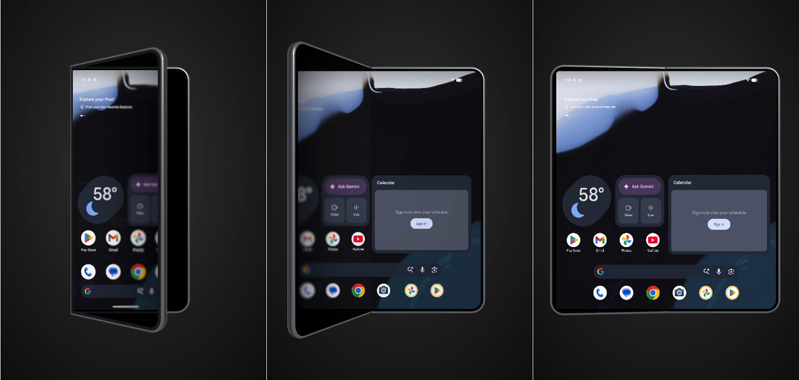
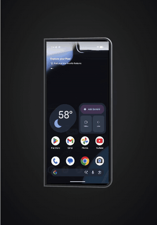

# Fold View: two sensors, one animation

How rPlayHub Android turns a foldable's hinge into the fold animation on the Mac, and where that
animation could live if it ran on the phone instead.

Living version (with the pipeline diagram): <https://claude.ai/code/artifact/5b601ccb-d3a7-4f77-9ff7-6db2476f3882>
Engineering detail: [`rplayhub-fold-twin-brief.md`](rplayhub-fold-twin-brief.md) — §5 findings, §6 macOS status, §7 the comparison against the iPhone Duo recreation.



## What we built

A real Pixel Fold's hinge drives a 3D phone on the Mac, and the fold can be drawn the way the
iPhone Duo draws it rather than the way Android draws it today.

Two sensors do the work. The **hinge-angle sensor** says how far open the phone is; the
**rotation vector**, fused from the phone's IMUs, says how it is held. The Mac builds the phone as
two hinged halves, opens them to the hinge angle, turns the whole body to the rotation vector, and
paints the live mirror onto the glass.

The difference people notice is in the last step. On a Pixel Fold today the picture is painted on
the glass and folds with the panel, jumping from cover to inner screen at a threshold angle. In our
Locked and Stylized looks the picture holds still in space and the glass moves through it, blurring
toward the moving edge — the Duo effect, running on a Pixel's own hardware.

## The two sensors

The hinge says how far open the phone is; the rotation vector says how it is held. Everything else
follows from those two numbers.

| Sensor | Android type | What it reports | Rate as measured on the Pixel 11 Pro Fold |
| --- | --- | --- | --- |
| Hinge Angle Sensor (wake-up) | 36, on-change | One float: 0° shut, about 175° flat | Steps of 5°, roughly 20 ms apart; a whole open is about 1 s and 36 samples. A fast sweep skips to 10° steps |
| Rotation Vector | 11, continuous | A quaternion: the phone's attitude in the world | 100 Hz on the wire |
| Gyroscope × 2 (TDK ICM45631, ICM45621) | 4, continuous | Angular rate per IMU, one in each half | 400 Hz each; streamed and kept fresh, not yet used in the model |

Three things worth saying out loud about the hinge:

- **It never reads 180°.** Flat tops out at 175°, so "fully open" is a range, not a value.
- **It reports only while moving.** Hold the phone still and the stream goes silent, which is why
  the host eases toward the last reading rather than waiting for the next one.
- **The posture vocabulary is separate.** The phone also announces CLOSED, HALF_OPENED and OPENED
  (six states in all), switching at fixed angles: opening, HALF_OPENED at 5° and OPENED at about
  135°; closing, HALF_OPENED at about 120° and CLOSED at about 35°. That vocabulary, not any `ro.*`
  property, is how we know a device folds at all.

The second gyroscope is the interesting one for later. With one IMU in each half, comparing the two
rates tells us which half actually moved — whether you opened the lid or lifted the base. The model
assumes the lid moves; the sensors to do better already stream.

## From sensor to screen

Sensor readings ride a fourth socket beside video, audio and control, and the host renders them on a
short delay so a bursty link cannot jerk the model.

```
Pixel Fold                     Agent                     Mac
  hinge angle    type 36        28-byte packets   adb      jitter buffer   renders 60-250 ms behind
  rotation vec   100 Hz   ──▶   tags 1-4         ──▶       fold model      two hinged halves
  two gyros      400 Hz         flag 0x100                 look shader     cut, locked, stylized
```

Google's screen-sharing agent, which we build from its Apache-2.0 source, gained a sensor channel of
our own (flag `0x100`). Each packet is 28 bytes: an 8-byte sensor timestamp, four floats, and a tag
saying which sensor sent it — 1 rotation vector, 2 hinge, 3 and 4 the two gyroscopes. The agent runs
over adb for the session and leaves with it; nothing is installed on the phone.

The timestamps are the point. Over Wi-Fi the packets arrive in clumps, so the host keeps a short
history on the *sensor's* own clock, estimates the phone-to-Mac offset from the least-delayed recent
packet, and asks for "the hinge as it was N milliseconds ago", interpolating between readings. That
is a jitter buffer, as a video player has: constant small latency instead of variable jerks. The
buffer sizes itself to the jitter it measures, between 60 and 250 ms, and the render clock slews
into a new size at up to 10% of real speed rather than jumping — a lesson from 1.1.1, where each
resize moved the clock in a single frame and the model visibly hopped.

Measured on the Pixel 11 Pro Fold over home Wi-Fi: median delay 5–20 ms, 95th percentile 40–250 ms,
worst case about 380 ms. A USB cable removes most of that.

## The model

The phone is built as two hinged halves with the crease on the left, and the whole assembly slides
sideways as it shuts so the fold happens in place rather than drifting off screen.

- **Half A, held.** The right half. It carries the camera block and takes the rotation-vector pose,
  so it stands still in the world while the other half swings.
- **Half B, moving.** The left half, hanging from a pivot on the crease. Turning the pivot by
  (180° − hinge) swings its inner face onto A's: flat at 175°, shut at 0°.
- **The cover display** is a plane on B's outer face, which is the face left pointing at you when
  the phone is shut.

Android decides which panel streams, and we follow rather than guess. Only one display streams at a
time, so the Mac tells the panels apart by shape: the inner display is near-square (2076×2152), the
cover about half as wide (1080×2342). Opening the phone, Android hands the stream over at 45–55°,
well after the posture says HALF_OPENED; closing, it hands back at 0–30° after CLOSED. The last
inner frame stays on the inner glass while the cover goes live, and the last cover frame is kept so
the next fold lights the cover before Android hands that stream over.

The hinge reading is eased on top of the jitter buffer, because 5° steps would otherwise read as
stair-steps rather than one sweep. A `fold:` line in the log records every reading and every
handover, which is how the numbers above were measured rather than guessed.

## The three looks

All three draw the same hinge; they differ only in what the moving half's glass shows.
View ▸ Fold Look, or keys 1, 2, 3.

| Look | What the moving half shows | What it demonstrates |
| --- | --- | --- |
| Hard Cut | The picture painted on the glass, folding with the panel; cover picture until the threshold, then inner | What a Pixel Fold does today |
| Locked | The flat picture as seen through the glass — content fixed in space, the panel moving through it | The ground truth the Duo approximates |
| Stylized | Locked, plus blur and darkening that grow toward the moving edge, and the half turning to frosted glass | The iPhone Duo look |



**How Locked works.** Both the glass and the content are flat, so the mapping between them is a
homography. For every fragment of the moving half, a Metal shader intersects the ray from the eye
through that fragment with the content plane fixed to the held half, and samples there. That is
exact rather than an approximation, and it is per fragment rather than the per-vertex grid our Linux
client uses, so a circle across the crease stays round and a diagonal stays straight at 120°.

**The eye matters.** Apple's recreation projects from an eye fixed straight in front of the phone —
right on a real Duo, where the viewer is always in front of it. We project from the actual camera
instead. In Fold View the two are the same thing; in the gyro-tracked 3D view they are not, and
projecting for the wrong eye made icons on the moving half balloon (fixed in 1.1.2).

**Stylized constants**, all overridable with `RPLAYHUB_FOLD_STYLE`: blur radius 72 source pixels at
the moving edge, gradient exponent 1.35, darkening starting 20% along the half at twice the
transition strength, glass 0.1. A `lock` dial blends between content fixed in space (1, the default)
and carried by the glass (0).

One honest note: Apple has published no details. The reference is the community Three.js recreation
built on Apple's own model, read shader by shader, and it matches Apple's one-line description —
content stays locked in space while the phone reorients around it.

## Could this run on the phone?

Yes, and there are two honest routes: an overlay on top of everything, which ships today without
root, or SystemUI's own unfold transition, which is where it belongs if a platform build is on the
table. SurfaceFlinger is the one place it does not fit.

| Layer | What it already does for folds | Can it host this? | The catch |
| --- | --- | --- | --- |
| App + accessibility overlay | Nothing by default | Yes, no root | A touch-transparent window above every app, an AGSL shader, the hinge sensor. Secure windows (banking, DRM) cannot be captured, and the cover-to-inner swap still leaves a gap |
| SystemUI unfold transition | Reads `TYPE_HINGE_ANGLE`, turns it into 0–1 progress and hands it to Launcher, wallpaper and SysUI over `IUnfoldAnimation` / `IUnfoldTransitionListener` | Yes, the natural home | Platform build and an OEM to ship it; the progress plumbing exists, the projective draw does not |
| WindowManager / shell transitions | Animates windows across a display change | Partly | It moves whole windows; our effect is one picture across two panels, not per-window |
| DisplayManager (LogicalDisplayMapper) | Decides the panel handover and whether the phone sleeps on fold | Not an animation layer | But it owns the timing, and overlapping both panels during the swap would start here |
| SurfaceFlinger / composer | Composes layers, per-layer transform, cross-window blur | No, not as it stands | Layer transforms are affine, and hardware overlay planes do scale, rotate and flip only. A homography forces GPU composition and a RenderEngine change — worth confirming against current AOSP |

**What the overlay route looks like in practice.** [duo-open](https://github.com/marcoazeem/duo-open)
does exactly this on a Pixel Fold today: an accessibility service draws a touch-transparent overlay
above every window, an AGSL shader bends and frosts it, and the hinge sensor drives the progress. It
offers both a snapshot mode and a live mode that leans on SurfaceFlinger's cross-window blur. That
it exists is the proof the idea carries beyond a demo; its limits — secure windows, the swap gap —
are the ones any route inherits.

**What we would hand over.** The twin is a measuring rig, not a toy: it can export the numeric
homography the Locked look implies at every 5° of hinge angle, as 4×4 matrices, plus the Stylized
constants and the measured posture and handover thresholds. That file is the input to whichever
layer draws it — a curve someone can hardcode rather than re-derive.

**The one thing the twin cannot tell you** is latency. The mirror and the sensor channel add tens of
milliseconds that an on-device implementation would not have. Tune the look here; measure the timing
there.

## Demo script

With the Fold on a USB cable. Install [rPlayHub Android 1.1.2](https://github.com/rPlayAI/rplayhub-android/releases/tag/v1.1.2)
— notarized, the agent is bundled, nothing to install on the phone.

**Before you stand up**

1. On the phone: Developer options ▸ USB debugging on, Settings ▸ Display ▸ **Continue using apps on
   fold ▸ Always**, screen lock off or unlocked, brightness up.
2. Plug in, accept the debugging prompt, click the device in the sidebar, **View Screen** (⌘M).
3. View ▸ **Fold View** (⇧⌘D), then View ▸ Fold Look ▸ **Stylized**. Wait four seconds for the
   readout to fade.

**The run, about ninety seconds**

1. **Open the phone slowly.** "The Mac is reading the hinge sensor — about 36 readings from shut to
   flat." Let the glass and the blur do the talking.
2. **Switch to Hard Cut (key 1) and fold again.** "This is what a Pixel Fold draws today: the
   picture is painted on the glass and folds with it."
3. **Back to Stylized (key 3), fold again.** "This is the iPhone Duo way: the picture stays still
   and the panel moves through it. Same phone, same sensor."
4. **View ▸ View Screen in 3D (⌘3), press R, turn the phone while folding.** The shot nobody else
   has: hinge and attitude at once.

**Two things to avoid on stage**

- Don't click another device in the sidebar mid-demo — selecting a row prepares a session and can
  pull the stage off the Fold.
- Don't fold fast on Wi-Fi. If the cable is out, the picture handover between cover and inner lands
  late and the swap shows.

**If something goes wrong.** The dark flash just before the phone shuts is Android switching its
inner display off, not us — say so and carry on. If the session drops, it reconnects itself; the
fold-time crash that caused that was fixed in 1.1.1.
